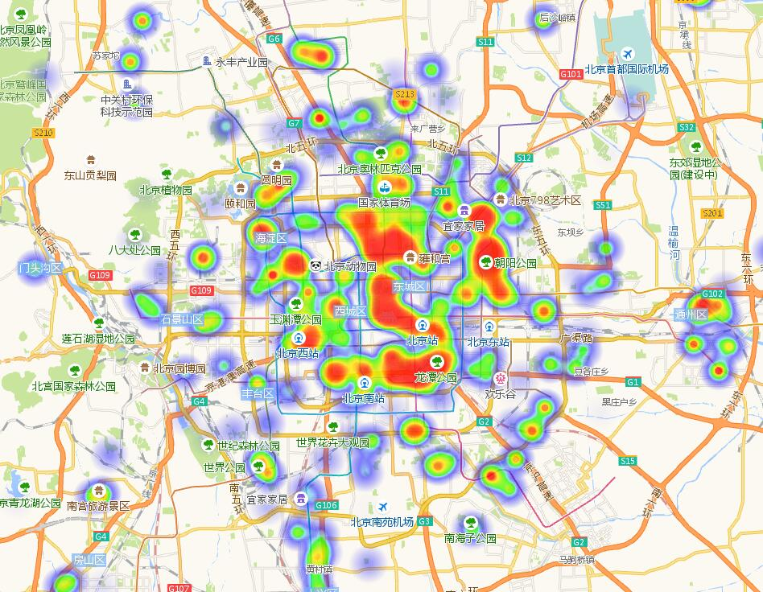
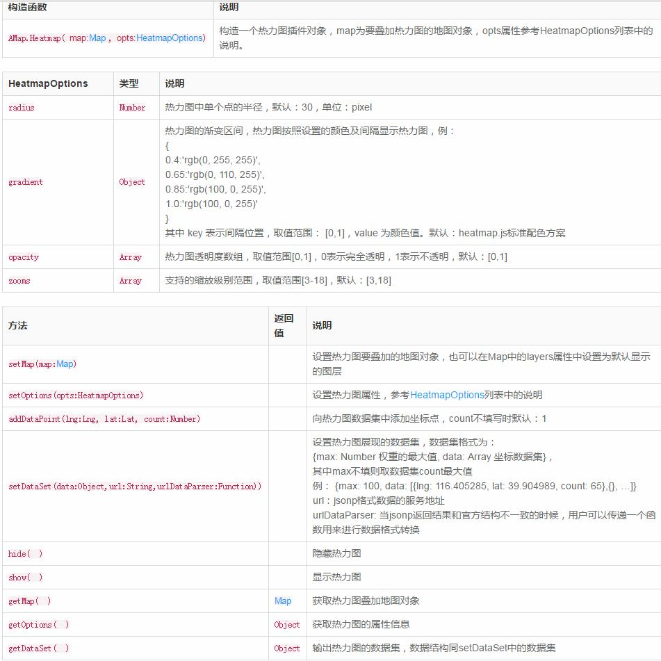

# 【三】高德地图  热力图加聚合数据~c~

### 1.运行

```
* $ git clone 地址
* npm install 
* $ gulp;
```

### 2.说明

* 官方提供的热力图没有显示数据



* api也没有提供事件



* 热力图结合聚合数据进行热力数据显示，因为热力图其实也是一种聚合，唯一需要确认的是就是热力图的计算方式和聚合模式的的计算方式一样即可。

* 这个demo是模拟的数据随机。有些点没有包括聚合内部，在热力图可以显示为散点。按道理聚合点也应该显示散点，我这里影藏。


